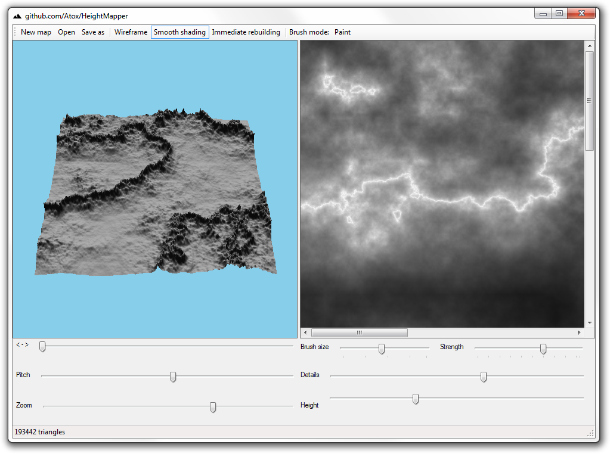

# HeightMapper
Simple height map viewer/editor tool

## Features
- Loading height maps stored in image files and creating them from scratch
- Adjustable 3D preview viewport
- Interactive model calculation
- Simple editing brushes

## How to build
Software comes with Visual Studio 2013 project and utilizes OpenTK library. For building the application, OpenTK and OpenTK.GLControl must be linked to the project (you can use NuGet in Visual Studio to download packages).

## Credits
[LockBitmap.cs](https://gist.github.com/tkouba/0b7f8496f1aadcfee2db) by [tkouba](https://gist.github.com/tkouba)
